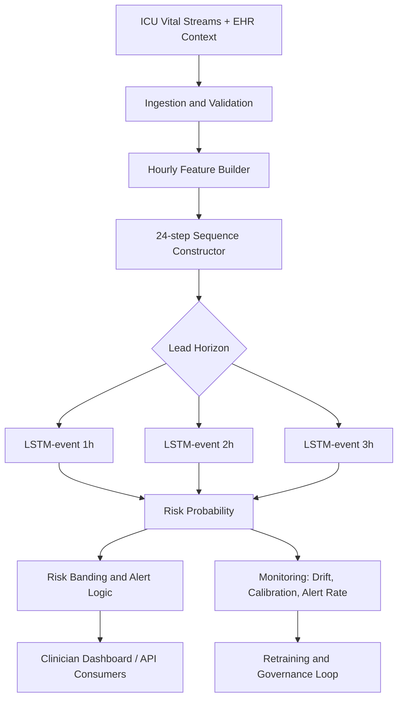

# Mid-Term Presentation Guide (Detailed + 4-Slide Summary)

Use this document to prepare a progress-focused mid-term presentation.

Constraint reminder:
- Exactly 4 slides.
- This is a progress evaluation, not a final-results defense.
- Weight: 10 percent of total course grade.

Last refreshed: 2026-03-08

## 1) Detailed Content for the Presentation

### A. SDG and Problem Definition

#### SDG alignment
- SDG number: SDG 3 (Good Health and Well-Being).
- Sector: Healthcare, critical care (ICU clinical decision support).
- SDG target linkage: early identification of deterioration supports improved outcomes and safer care pathways.

#### Real-world measurable problem
- Problem statement: predict short-term ICU deterioration risk at 1h, 2h, and 3h horizons using hourly vitals and condition context.
- Current gap: static threshold alerts are often noisy and not condition-aware, which increases false alerts and reduces trust.
- Measurable objective: produce calibrated risk probabilities per lead horizon that support earlier and more targeted intervention.

#### Who is affected
- ICU patients: delayed detection can worsen outcomes.
- Clinicians (nurses, residents, intensivists): high alert burden and context-poor alarms reduce usability.
- Hospital operations: inefficient escalations and avoidable downstream resource pressure.

#### Why it matters
- Earlier warning can improve treatment timing.
- Better risk stratification can reduce alarm fatigue.
- A condition-aware model can improve relevance versus one-size-fits-all thresholds.

#### What success looks like (progress-phase metrics)
Model quality metrics (per lead):
- ROC-AUC (ranking quality)
- AUPRC (rare-event relevance)
- Brier score (probability calibration quality)

System and deployment metrics:
- API health uptime
- p95 inference latency target in production deployment
- model artifact size and startup load behavior

Clinical utility metrics (final phase targets):
- alert rate per patient-day
- precision at top-k alerts
- time-to-intervention lead gain versus current workflow

Current progress snapshot (LSTM-event deployed family):
- Lead 1h: ROC-AUC 0.7343, AUPRC 0.00609, Brier 0.01884
- Lead 2h: ROC-AUC 0.7300, AUPRC 0.00574, Brier 0.01948
- Lead 3h: ROC-AUC 0.7445, AUPRC 0.00620, Brier 0.02879

### B. Data and Preprocessing

#### Dataset source (real, publicly available)
- Source: MIMIC-IV v3.1 (PhysioNet), credentialed but publicly available for approved use.

#### Data characteristics
- Core rolling dataset: `data/processed/rolling_window_multicondition_timeseries.csv`
- Size: 2,042,802 rows (hourly windows)
- ICU stays represented: 55,156
- Time range: first 48 hours from ICU admission
- Condition-aware context: sepsis, heart_failure, ckd, diabetes, other

Features used in sequence model:
- Numeric vitals: `heart_rate`, `sbp`, `map`, `resp_rate`, `spo2`, `temp_f`
- Condition one-hot vector appended at each time step
- Sequence length: 24

Target variables:
- `target_event_in_1h`
- `target_event_in_2h`
- `target_event_in_3h`

#### Initial EDA insights
Class imbalance:
- Rare-event task with sub-1 percent positive prevalence in lead-time labels.
- This is why AUPRC is emphasized during evaluation.

Missing values:
- Low residual missingness after feature engineering and fill operations.
- Missing numeric vitals are handled by stay-wise forward/backward fill, then median fallback.

Distributions:
- Vitals show clinically plausible medians with heavy-tail outliers in some channels.
- Robust summaries (quantiles) are preferred over mean-only interpretation.

#### Preprocessing steps (implemented)
Cleaning:
- Numeric coercion for vitals and key index columns.
- Filter to modeling window (`hour_from_icu` 4 to 44).
- Drop rows missing `stay_id`, `hour_from_icu`, or `condition_input`.

Imputation and encoding:
- Stay-wise forward fill then backward fill for each vital.
- Median fallback for remaining missing vital values.
- Condition converted to one-hot at each time step.

Train-test split:
- Split at stay level (not row level) to reduce leakage.
- 80/20 train/test by stay with stratification on stay-level target presence.
- Additional validation split within training cohort for early stopping.

Resampling controls used in current LSTM-event training:
- `LSTM_EVENT_RESAMPLE_ENABLED=1`
- `LSTM_EVENT_TARGET_MINORITY_RATIO=0.15`
- `LSTM_EVENT_POSITIVE_OVERSAMPLE_MULTIPLIER=2.0`

### C. Proposed ML/DL Architecture and Deployment Plan

#### Industry-deployable architecture (progress recommendation)
Primary progress deployment:
- FastAPI inference service with 3 lead-specific LSTM-event artifacts.
- Endpoints: `/health`, `/predict`, `/ws/live`.
- Dockerized for cloud deployment and reproducible packaging.

Why selected now (time-series effect):
- Deterioration risk is time-dependent; sequence models capture trajectory and persistence effects.
- LSTM-event outperforms GRU in current lead-wise ROC-AUC results.
- Lead-specific artifact mapping matches API contract directly (`lead_hours` 1, 2, 3).

Transparent tradeoff:
- Boosted baseline still shows stronger discrimination in current benchmark.
- Mid-term project direction intentionally emphasizes sequence-aware modeling for temporal risk dynamics.
- Boosted remains a shadow benchmark for comparative monitoring.

#### Constraint-based justification
Accuracy:
- LSTM-event improves over GRU across leads.
- Boosted baseline remains a high-performing comparator.

Latency:
- Single-request API inference is lightweight enough for online serving targets.
- Further profiling under concurrent load is a planned next step.

Compute cost:
- LSTM serving needs more CPU/GPU budget than tabular boosting but remains manageable at current model scale.

Storage:
- 3 compact `.keras` artifacts (1h/2h/3h) are straightforward to package and version.

Scalability:
- Stateless API container allows horizontal scale-out.
- Clear lead-based routing and model loading path.

Ethical risk:
- Single-site data risk and subgroup disparity risk acknowledged.
- Threshold governance and fairness reporting included in roadmap.

#### Deployment target
Recommended: Hybrid cloud-first.
- Cloud backend for model hosting, observability, retraining orchestration.
- Edge/bedside client for UI and buffering, with fallback logic if connectivity is unstable.

#### High-level system diagram

### D. Challenges and Next Steps

#### Technical risks
- Rare-event imbalance can destabilize precision-recall behavior.
- Sequence overfitting risk without strict validation controls.
- Current API sequence input is simplified at inference; full rolling-window live ingestion should be completed.

#### Deployment risks
- Latency spikes under concurrency and startup load behavior.
- Data drift and calibration drift over time.
- Upstream data quality changes can degrade performance.

#### Ethical concerns
- Generalization limits from single-source training corpus.
- Potential subgroup disparity in performance.
- Alert burden and clinician trust risk if thresholding is not tuned.

#### Clear roadmap to final project
1. Complete temporal holdout validation and subgroup fairness reporting.
2. Add load-testing and p95/p99 latency tracking in deployment pipeline.
3. Implement live rolling-window feature ingestion in serving path.
4. Perform lead-specific threshold tuning with clinician feedback.
5. Run pilot deployment with drift and calibration dashboards.
6. Finalize governance checklist (monitoring, retraining cadence, rollback policy).

### E. Rubric Coverage Map (10 marks)

1. SDG and problem clarity (1.5): SDG 3 alignment, measurable ICU task, direct real-world justification.
2. Data and EDA quality (1.5): credible source, imbalance and missingness insight, justified preprocessing.
3. Architecture and deployment justification (3.0): model choice rationale, constraints table logic, deployable plan.
4. Technical depth and systems thinking (1.5): end-to-end pipeline and monitoring/retraining loop.
5. Challenges and roadmap (1.0): explicit risks plus concrete final-phase plan.
6. Presentation and Q&A (1.5): structured 4-slide flow plus ready answers.

## 2) Four-Slide Summary (Use This in Deck)

This section is the direct 4-slide version.

### Slide 1 - SDG, Problem, and Success Criteria

On-slide bullets:
- SDG 3 (Good Health and Well-Being), ICU decision-support sector.
- Problem: predict deterioration risk 1h/2h/3h ahead from hourly vitals + condition context.
- Why it matters: earlier intervention, reduced alarm fatigue, better triage.
- Success metrics: ROC-AUC, AUPRC, Brier, alert burden, latency.

What to say (speaker notes):
- This is a progress-stage project aligned to SDG 3.
- We solve a measurable forecasting task with explicit lead horizons.
- We evaluate model quality and system quality together, not model metrics alone.

Evidence to cite:
- Current deployed LSTM-event metrics by lead (1h, 2h, 3h values above).

### Slide 2 - Data, EDA, and Preprocessing

On-slide bullets:
- Source: MIMIC-IV v3.1, real and publicly accessible under credentialed access.
- Scope: 2,042,802 hourly rows, 55,156 ICU stays, first 48h.
- Inputs: 6 vitals + condition encoding; targets: event in 1h/2h/3h.
- EDA: rare-event imbalance, low residual missingness, outlier-aware distributions.
- Preprocessing: fill strategy, one-hot condition encoding, stay-level train/test split.

What to say (speaker notes):
- Highlight that leakage risk is controlled with stay-level splitting.
- Explain why AUPRC is essential in rare-event settings.
- Emphasize that preprocessing is designed for deployment reproducibility.

Visual options:
- `Complete Folder/plots/vitals_timeseries_6_vitals_4_conditions.png`

### Slide 3 - Architecture and Deployment Plan

On-slide bullets:
- Current deployable architecture: FastAPI + Docker + 3 lead-specific LSTM-event models.
- Why LSTM now: captures time-series trajectory effects for near-term deterioration.
- Tradeoff: boosted baseline still stronger in discrimination, kept as shadow benchmark.
- Deployment target: hybrid cloud-first with monitoring and retraining loop.

What to say (speaker notes):
- Clarify this is a progress decision prioritizing temporal modeling direction.
- Show that deployment constraints were considered: latency, compute, storage, scalability, ethics.
- Mention endpoints and operational readiness (`/health`, `/predict`, `/ws/live`).

Visual options:
- `Complete Folder/plots/deployed_model_metrics.png`
- `Complete Folder/plots/rolling_model_metrics_comparison.png`

### Slide 4 - Risks, Roadmap, and Mid-Term Progress Status

On-slide bullets:
- Technical risks: imbalance, overfitting, live-sequence ingestion gap.
- Deployment risks: concurrency latency, drift, data quality changes.
- Ethical risks: bias, fairness, alarm burden.
- Roadmap: temporal validation, fairness reporting, load testing, threshold tuning, pilot.

What to say (speaker notes):
- Reinforce this is not final performance; it is evidence of project clarity and systems thinking.
- Present concrete next milestones with monitoring and governance.
- End with a clear ask: proceed to pilot-oriented final phase.

Visual options:
- `Complete Folder/plots/overfitting_comparison_auc_15pct.png`
- `Complete Folder/plots/lstm_overfitting_curve_15pct.png`

## 3) Q&A Preparation (High-Probability Questions)

Q1. Why choose LSTM-event if boosted ROC-AUC is higher?
- We selected LSTM-event for temporal trajectory modeling and sequence-first deployment objectives at this stage.
- Boosted remains in shadow evaluation to enforce objective comparison and governance.

Q2. Is the dataset real and credible?
- Yes, MIMIC-IV v3.1 from PhysioNet is a real ICU EHR dataset with credentialed public access.

Q3. How do you avoid leakage?
- Split is performed by `stay_id`, not random row-level split.

Q4. How will you control alert fatigue?
- Lead-specific threshold tuning, calibration review, and alert-rate monitoring are planned before final rollout.

Q5. What proves systems thinking?
- End-to-end pipeline includes ingestion, inference, monitoring, drift detection, and retraining governance.

## 4) Delivery Tips (For Better Presentation Marks)

- Keep each slide to 45-60 seconds.
- State clearly that results are interim and progress-oriented.
- Use one visual per slide where possible; avoid crowded layouts.
- In Q&A, answer with tradeoffs (not absolute claims).
- Always connect back to patient impact and operational feasibility.
