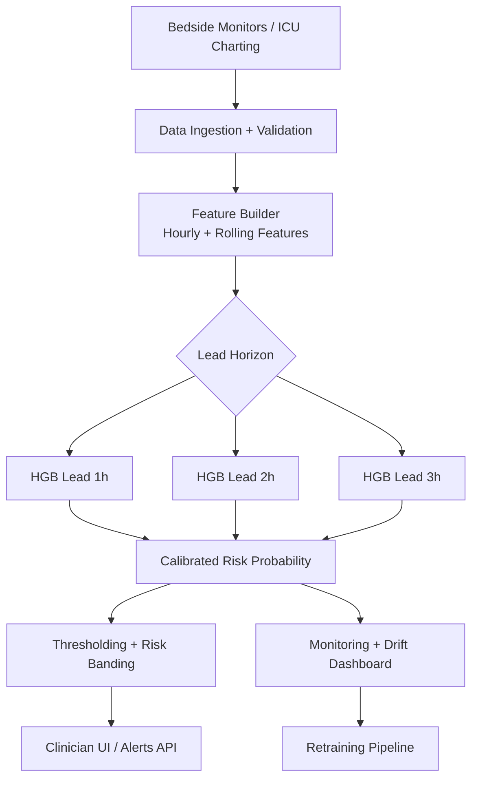

# Model, Data, and Deployment Brief

This document summarizes the current project status for presentation.

Last refreshed: **2026-03-07** after retraining with minority-target balancing experiments.

## Data & Preprocessing

### Dataset source (real, publicly available)
- **MIMIC-IV v3.1** (PhysioNet), a real-world ICU EHR dataset.
- Publicly available via PhysioNet under credentialed access and data use agreement.

### Data characteristics

#### Size
- `data/processed/condition_model_table_v1.csv`: **55,203 rows x 14 columns**
- `data/processed/condition_model_table_v2_with_24h_vitals.csv`: **55,203 x 49**
- `data/processed/hourly_vitals_48h.csv`: **2,042,802 x 34**
- `data/processed/rolling_window_multicondition_timeseries.csv`: **2,042,802 x 39**
- Unique ICU stays in rolling data: **55,156**
- Hour range in rolling data: **0 to 47 hours from ICU admission**

#### Features
- Core vitals: `heart_rate`, `sbp`, `map`, `resp_rate`, `spo2`, `temp_f`
- Rolling features (24 total):
  - means over 1h/3h/5h
  - 5h slopes
- Derived feature: `hr_minus_map`
- Condition context (`condition_input` or encoded `condition_code`)
- Deployed rolling boosted models use **32 features** (see `modeling/artifacts/rolling_boosted/metadata.json`).

#### Target variable
- For rolling lead-time models:
  - `target_event_in_1h`
  - `target_event_in_2h`
  - `target_event_in_3h`
- For earlier mortality model family:
  - `hospital_expire_flag`

### EDA and imbalance insights

#### Class imbalance
- On full rolling table (`2,042,802` rows):
  - `target_event_in_1h`: **9,998 positives** (0.489%)
  - `target_event_in_2h`: **9,471 positives** (0.464%)
  - `target_event_in_3h`: **8,893 positives** (0.435%)
  - `hospital_expire_flag`: **319,876 positives** (15.66%)
- On training window used by rolling models (`hour_from_icu` 4..44, `1,780,256` rows):
  - `target_event_in_1h`: **8,152 positives** (0.458%)
  - `target_event_in_2h`: **7,639 positives** (0.429%)
  - `target_event_in_3h`: **7,116 positives** (0.400%)
  - `hospital_expire_flag`: **275,284 positives** (15.46%)

#### Latest rebalancing settings (15% minority target)
- New training controls were added for all model families to combine majority downsampling and minority oversampling.
- Rolling boosted training (`train_rolling_boosted_models.py`) now records before/after class counts in metrics output:
  - Lead 1h: before **6,522 / 1,419,059** (pos/neg), after **13,044 / 73,916**, train minority rate **0.1500**
  - Lead 2h: before **6,111 / 1,418,487**, after **12,222 / 69,258**, train minority rate **0.1500**
  - Lead 3h: before **5,693 / 1,418,811**, after **11,386 / 64,521**, train minority rate **0.1500**
- Rolling GRU sequence training (`train_rolling_sequence_models.py`) uses positive repeat + negative keep probability per lead:
  - Lead 1h: positive repeat **2**, negative keep prob **0.0297**, achieved minority rate **~0.1500**
  - Lead 2h: positive repeat **2**, negative keep prob **0.0279**, achieved minority rate **0.1500**
  - Lead 3h: positive repeat **2**, negative keep prob **0.0261**, achieved minority rate **0.1500**
- Tabular and LSTM mortality tasks were already near the target prevalence, so class counts remained effectively unchanged:
  - Tabular train split: **6,841 / 37,275** (minority rate **0.1551**)
  - LSTM train split: **6,842 / 37,274** (minority rate **0.1551**)

#### Missing values
- Very low missingness after feature engineering and fill operations.
- Highest observed rates in training window are still low:
  - `temp_f` and temp rolling means: ~0.0149%
  - `map` and map rolling means: ~0.0085%
  - `sbp` and sbp rolling means: ~0.0062%

#### Distributions
- Robust quantiles in training window show clinically plausible ranges:
  - `heart_rate` median: **84** (q01=50, q99=134)
  - `sbp` median: **114** (q01=74, q99=177)
  - `map` median: **75** (q01=46, q99=122)
  - `resp_rate` median: **19** (q01=8, q99=36)
  - `spo2` median: **97** (q01=87, q99=100)
  - `temp_f` median: **98.2F** (q01=95.7, q99=101.6)
- Mean/std are inflated for some variables due to extreme outliers in raw charted values, so median/IQR/quantiles are preferred for interpretation.

### Preprocessing steps

#### Cleaning
- ICD-based cohort creation and condition mapping in `data_processing/prepare_condition_cohort.py`.
- Condition priority assignment: sepsis > heart_failure > ckd > diabetes > other.
- Vitals extraction from `chartevents` by specific ITEMIDs and ICU-relative time windows.

#### Scaling/encoding
- Logistic model (`train_calibrated_condition_models.py`):
  - Numeric: median imputation + standard scaling
  - Categorical (`condition_input`): most-frequent imputation + one-hot encoding
  - `class_weight="balanced"` is disabled automatically when explicit resampling is enabled
- Boosted model (same script):
  - Numeric: median imputation
  - Categorical: one-hot encoding
  - No scaling required for tree boosting
- Rolling boosted (`train_rolling_boosted_models.py`):
  - Median imputation in pipeline
  - Condition encoded as integer `condition_code`
  - Resampling controlled by env vars (`ROLLING_RESAMPLE_ENABLED`, `ROLLING_TARGET_MINORITY_RATIO`, `ROLLING_OVERSAMPLE_MULTIPLIER`)

#### Train-test split
- Mortality tabular model (`train_calibrated_condition_models.py`):
  - 80/20 stratified split by label (`hospital_expire_flag`)
- Rolling lead-time boosted (`train_rolling_boosted_models.py`):
  - Split by **stay_id** (80/20), stratified on stay-level target presence per lead horizon
- Rolling GRU (`train_rolling_sequence_models.py`):
  - Also split by **stay_id**, stratified at stay level
- LSTM baseline (`train_lstm_timeseries.py`, updated):
  - Per-stay 24h sequences, 80/20 stratified split on mortality label

## Proposed ML/DL Architecture & Deployment Plan

### Industry-deployable architecture (recommended)

**Primary production model:** calibrated HistGradientBoosting (HGB), one model per lead horizon (1h/2h/3h).

Why this is currently the best production candidate:
- **Accuracy:** outperforms GRU in rolling lead-time benchmarks.
- **Latency:** lightweight CPU inference for tabular input; no sequence-state handling at serving time.
- **Compute cost:** low compared with recurrent DL models.
- **Storage:** compact artifacts.
  - `calibrated_boosted_lead_1h.pkl`: 766,998 bytes
  - `calibrated_boosted_lead_2h.pkl`: 756,062 bytes
  - `calibrated_boosted_lead_3h.pkl`: 745,710 bytes
- **Scalability:** stateless FastAPI service, easy horizontal scaling.
- **Ethical risk control:** simpler model behavior and easier threshold governance than opaque deep sequence models.

### Performance snapshot

#### Main tabular comparison (mortality family)
- HistGradientBoosting: ROC-AUC **0.7799**, AUPRC **0.4590**, Brier **0.1079**
- Calibrated HGB: ROC-AUC **0.7781**, AUPRC **0.4513**, Brier **0.1084**
- LSTM (24h vitals): ROC-AUC **0.7736**, AUPRC **0.4606**, Brier **0.1086**
- Logistic Regression: ROC-AUC **0.7137**, AUPRC **0.3270**, Brier **0.1198**

#### Rolling lead-time comparison (event prediction)
- Boosted (lead 1h/2h/3h):
  - ROC-AUC: **0.8892 / 0.7753 / 0.7616**
  - AUPRC: **0.0326 / 0.0117 / 0.0112**
  - Brier: **0.0386 / 0.0345 / 0.0339**
- GRU (lead 1h/2h/3h):
  - ROC-AUC: **0.7282 / 0.7049 / 0.7036**
  - AUPRC: **0.0061 / 0.0051 / 0.0051**
  - Brier: **0.0241 / 0.0350 / 0.0168**

### Deployment target

**Recommended target: Hybrid cloud-first**
- **Cloud backend** for model hosting, calibration updates, monitoring, and retraining orchestration.
- **Edge/client bedside app** for UI, local buffering, and fallback rule-based alerts if connectivity is intermittent.

Current implementation is cloud/container style:
- FastAPI backend + static frontend
- Dockerized deployment with stack orchestration under `deployment/`.

### High-level system diagram

## Challenges & Next Steps

### Technical risks
- Severe class imbalance for lead-time targets (<0.5% positives) can destabilize rare-event performance.
- Rebalancing can improve representation but can also shift calibration, requiring post-training threshold and calibration checks.
- Potential overfitting to surrogate event definition (`zero_hour` logic).
- Sequence models improved after rebalancing but still underperform boosted models on lead-time discrimination.
- Outlier-prone vitals distributions require robust handling and possibly winsorization/physiology constraints.

### Deployment risks
- Real-time latency spikes under high concurrency if preprocessing grows.
- Model drift from changing patient mix or workflow.
- Data quality drift (missing streams, sensor artifacts, mapping changes).

### Ethical concerns
- Single-center source bias (MIMIC) may limit external generalization.
- Potential subgroup performance disparities by age/sex/condition severity.
- Alert burden can worsen alarm fatigue if thresholds are not carefully tuned with clinicians.

### Roadmap to final project

1. **Finalize dataset QA and robust feature constraints**
   - Add physiologic clipping/winsorization, explicit outlier audits.
2. **External-style validation protocol**
   - Temporal split and subgroup fairness reporting.
3. **Production model hardening**
    - Keep boosted model as primary; run GRU in shadow mode for ongoing comparison.
4. **Monitoring layer**
   - Add drift, calibration, and alert-rate dashboards.
5. **Clinical threshold calibration**
   - Tune decision thresholds per condition and workflow with stakeholders.
6. **Pilot deployment**
   - Cloud-first pilot + bedside UI; measure latency, PPV, alert acceptance.
7. **Iterative governance cycle**
   - Monthly retraining review, fairness audit, and performance regression checks.
