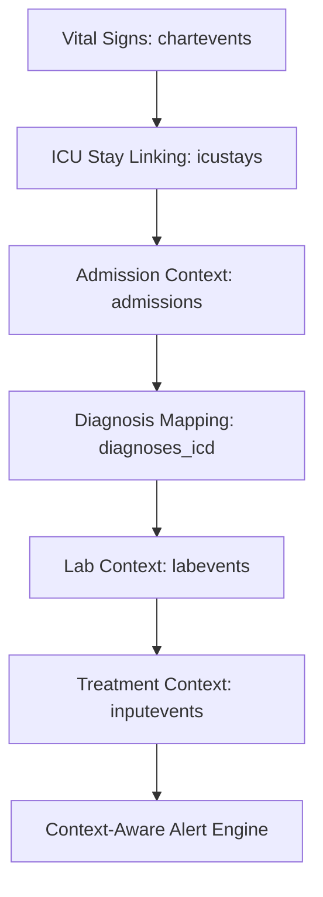

# 🏥 Context-Aware ICU Alerting System  
*A Disease-Conditioned Early Warning Framework using MIMIC-IV*

---

## 📌 Overview

Traditional ICU monitoring systems rely on fixed physiological thresholds (e.g., HR > 100 bpm → alert).  
However, these thresholds ignore clinical context such as:

- Underlying diagnosis  
- Admission type  
- Treatment interventions  
- Laboratory abnormalities  

This project builds a **context-aware ICU alerting system** that dynamically adapts alert thresholds based on patient-specific clinical context.

The system is developed using the **MIMIC-IV (v3.1) critical care dataset**.

---

## 🎯 Motivation

A heart rate of 110 bpm may be:

- Expected in **sepsis**
- Dangerous in **post-operative neurosurgery**
- Acceptable in **chronic atrial fibrillation**

Generic alerting leads to:

- 🚨 Alarm fatigue  
- ❌ High false positive rates  
- ⚠ Missed deterioration  

This project aims to design a **disease-conditioned alert framework** that improves clinical relevance and personalization.

---

## 🗂 Dataset

Data source: **MIMIC-IV v3.1 (PhysioNet)**

### ICU Module
- `chartevents` → Time-series vital signs
- `icustays` → ICU stay linkage
- `inputevents` → Treatment administration

### Hospital Module
- `admissions` → Admission context & outcomes
- `diagnoses_icd` → Diagnosis codes
- `d_icd_diagnoses` → ICD code descriptions
- `labevents` → Laboratory results

---

## 🏗 System Architecture


---

## 🧠 Methodology

### 1️⃣ Data Processing
- Extract ICU time-series vitals
- Align vitals with ICU stay windows
- Map ICD codes to disease categories
- Aggregate labs into temporal bins
- Encode treatment exposures

### 2️⃣ Context Feature Engineering

Each time window includes:

- Multivariate vital signs (HR, MAP, RR, SpO₂, Temp)
- Disease category indicator
- Lab abnormality flags
- Treatment flags (vasopressors, sedation, fluids)

### 3️⃣ Alert Strategies

#### 🔹 Rule-Based Baseline
Disease-conditioned thresholds:
```text
If Sepsis:
  Alert if HR > 120 and MAP < 65

If COPD:
  Alert if SpO₂ < 88
```

#### 🔹 Statistical Modeling
Compute disease-specific baseline distributions:

$z = (x - \mu_{disease}) / \sigma_{disease}$

Alerts trigger when deviation exceeds learned thresholds.

#### 🔹 Deep Learning Extension (Planned)
- LSTM / Transformer architecture
- Input: Multivariate time-series + diagnosis embedding
- Output: Deterioration risk in next 6 hours

---

## 🚀 Goals

- Reduce alarm fatigue  
- Personalize ICU monitoring  
- Improve early detection of deterioration  
- Create a reproducible research framework  

---

## 📊 Potential Applications

- Personalized Early Warning Scores  
- Contextual anomaly detection  
- ICU deterioration prediction  
- Clinical decision support research  

---

## 📁 Project Structure
```text
condition-aware_risk_CDSS/
├── data_processing/
│   └── README.md
├── feature_engineering/
│   └── README.md
├── modeling/
│   └── README.md
├── evaluation/
│   └── README.md
├── deployment/
│   └── README.md
├── notebooks/
│   └── README.md
└── README.md
```

### Quick Links
- [data_processing/](data_processing/)
- [feature_engineering/](feature_engineering/)
- [modeling/](modeling/)
- [evaluation/](evaluation/)
- [deployment/](deployment/)
- [notebooks/](notebooks/)
- [README.md](README.md)

---

## 🔒 Data Access

Access to MIMIC-IV requires:

- PhysioNet credentialing  
- CITI training certification  
- Data use agreement  

No raw patient data is stored in this repository.

---

## 👤 Author

Samuel Adeniji

---

## 📜 License

This project is for research and educational purposes only.

